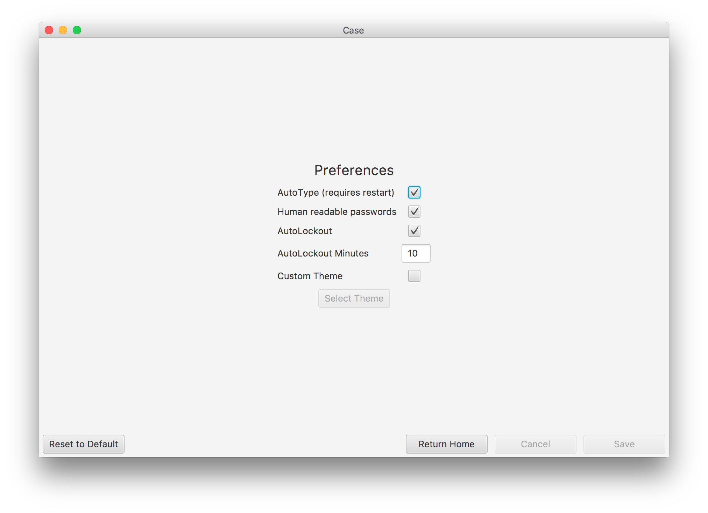

## Case 
Elegant, multiplatform password management based on the renowned KDBX technology.


Goals:
* Full integration with the [KDBX](https://en.wikipedia.org/wiki/KeePass) password format
* Implementation in JavaFX
* Responsive design, portable to multiple platforms
* Security
* Great performance and low memory use

### Status

Very much in development and not yet ready for real-world use. Supports most basic KeePass functionality on desktop. Future milestones include removing the AWT dependency (java.desktop module) and supporting mobile devices through GluonVM.

### Installation

* [Signed Jar](./dist/case-1.0.0.jar)
* Mac (todo)
* Windows (todo)
* Linux (todo)
* Android (todo)
* iOS (todo)

### Features

* AutoType: With Case open and a website's login field selected, type Command or Control with 'G' and Case will automatically type the username and password.
* Customizable Preferences:



* Platform integrated menu and shortcuts:


* Custom Themes:

With the following css file,
```css
.root {
    -fx-base: #0E2F44;
}
```


Or alternatively for a purple gradient background,
```css
.rootPane {
    -fx-background-color: linear-gradient(to bottom right, #ce0335, #cc00ff);
}
```


To build new themes, look at Case's [base stylesheet](./src/main/resources/css/base.css), the [Modena Stylesheet](https://gist.github.com/maxd/63691840fc372f22f470) and JavaFX's [CSS Reference](https://docs.oracle.com/javafx/2/api/javafx/scene/doc-files/cssref.html).

### Credits

Many thanks to the foundational work of:
* Jo Rabin, author of [KeePassJava2](https://github.com/jorabin/KeePassJava2)
* The [GluonVM](https://github.com/javafxports/javafxmobile-plugin) team, which should enable this project's mobile port
* Oracle's [JavaFX](https://docs.oracle.com/javase/8/javase-clienttechnologies.html) team

### Todo
* fix logic for adding/removing fields
* cache menu instead of recreating on each view
    * keep observable-list of custom menu items.

* Blocked
    * Remove java.desktop deps (see openjfx mailing list):
        * awt Robot
        * awt Desktop
    * Mobile views with GluonVM (need first to remove AWT)
        * https://github.com/javafxports/javafxmobile-plugin

* Enhancements / Appearance tweaks
    * create GUI for utils.PasswordGenerator
    * refactor entrymodel class (no need for delayed initialization of properties).
    * Show more details in listview; website, etc.
    * implement recycle bin
    * order recently opened files by access date on login screen
    * actually do something with expiration date.
    * remember screensize, position (Preferences)
    * work on group view
        * drag and drop entry to change group
        * ability to delete, edit groups
    * sorting based on title, website, updated, etc
    * A welcome tutorial on first visit
    * text formatting in expires field
    * clearable search field
    * launch at startup option
    
* Pull request to KeePassJava2
    * Add features to dom module present in other implementations: tags, history, times used, etc.
    * remove Guava, other big dependencies
    
* Deployment
    * signing
    * Native installers for PC and mobile.
    * create binary css files with javapackager

### Development Notes
How to build:
`mvn clean install compile package assembly:single`

Requirements when using SceneBuilder tool:
* Before opening file, go to Preview -> Scene Stylesheets -> Import and select resources/css/base.css.
* Then open the desired fxml file.
* Without importing the stylesheet, the app will hang and melt your computer.

FXML Notes: 
* Use Intellij Idea (Pro Version) or Eclipse with [e(fx)clipse](https://www.eclipse.org/efxclipse/install.html) for superior FXML integration.
* Use SceneBuilder to view hand-made FXML changes, instead of creating the FXML itself. Scenebuilder FXML output is frankly unreadable.
* Forward references for $variables are not supported. https://bugs.openjdk.java.net/browse/JDK-8090250

Javapackager command to build native images (not yet working):

javapackager -deploy -native dmg -BsystemWide=false -BappVersion=1.0.0 -name Case -title Case -vendor "August Nagro" -outdir dist -outfile Case-1.0.0 --module-path dist:/Users/august/.m2/repository/com/1stleg/jnativehook/2.1.0 --add-modules us.nagro.august.caseapp --module us.nagro.august.caseapp/us.nagro.august.caseapp.Main -description "Elegant, multiplatform password management based on the renowned KDBX technology"

